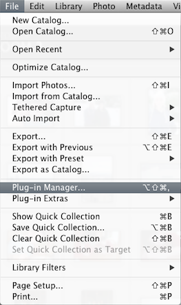
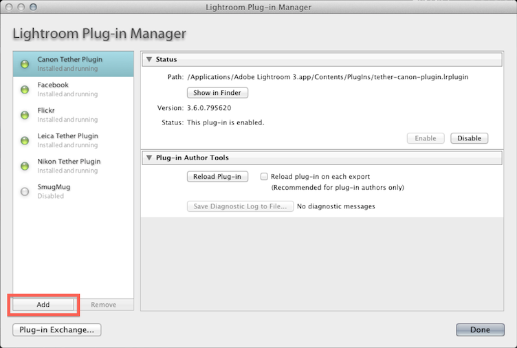
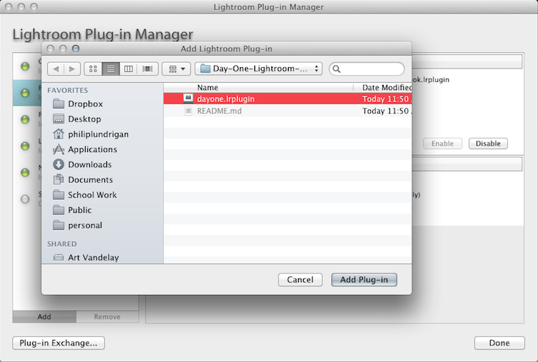
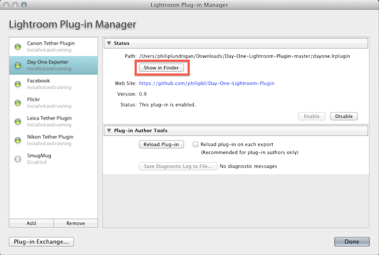
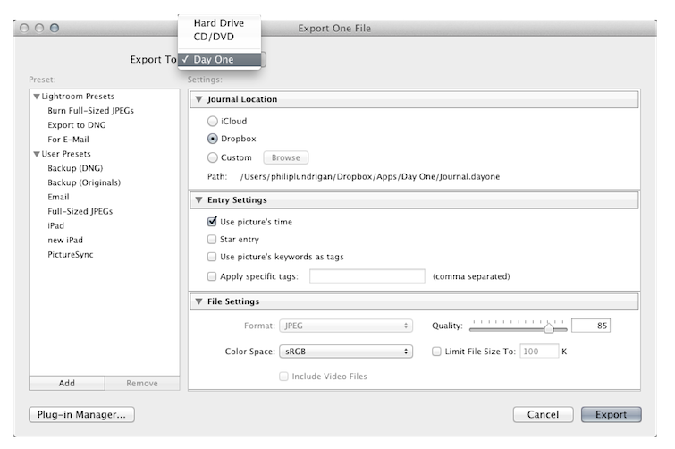

# Day One Lightroom Plug-in

This plug-in creates an export service for Lightroom that allows you to export pictures directly to Day One.

**Disclaimer**: The software is supplied "as is" and all use is at your own risk. Make sure to back up your journal entries!

## Install

First, [download][1] the project and unzip it. Next, rename `dayone.lrdevplugin` to `dayone.lrplugin`. The `.lrdevplugin` is used for when a plug-in is being developed.

There are two ways to add the plug-in to Lightroom. You can either put the plug-in anywhere on your hard drive and add it manually to Lightroom, or you can put it into Lightroom's plug-in directory and it will recognize it automatically.

### Manually
To add the plug-in manually, first choose a location where you want to place the plug-in and move it there. Next, inside Lightroom, select `File > Plug-in Manager...`.

Press `Add` on the bottom left of the dialog box and locate the plug-in. When you add the plug-in, it should be automatically enabled.

### Automatically
To add the plug-in automatically, move the plug-in to the modules folder of Lightroom. The location of the modules folder is dependent on the operating system you are using.

Operating System | Path
-----------------|------
In Mac OS (current user) | `~/Library/Application Support/Adobe/Lightroom/Modules`
In Mac OS (all users) | `/Library/Application Support/Adobe/Lightroom/Modules`
In Windows XP | `C:\Documents and Users\username\Application Data\Adobe\Lightroom\Modules`
In Windows 7 / Vista | `C:\Users\username\AppData\Roaming\Adobe\Lightroom\Modules`

Lightroom will automatically detect the plug-in the next time you start Lightroom.

Note: If you follow the instructions to add the plug-in automatically, the remove button of the Plug-in Manager will be grayed out. You must manually delete the plug-in from the modules folder of Lightroom. To do this, select Day One Exporter plug-in and press `Show in Finder` and delete `dayone.lrplugin`.

## Usage

To use this plug-in, select the picture(s) that you want to export and press the `Export` button in the Library module of Lightroom. In the export dialog box, change the `Export To:` drop down menu to `Day One`.

### Journal Location Options
This option allows you to choose where your Day One journal is located. If you use iCloud or the default Dropbox location, then you can use one of the first two options. If you have your Day One journal in a special location, then you can select the last option, and specify where the journal is located.

### Entry Settings

**Use picture's time**: This will use the time that the picture was taken as the creation time for the entry.

**Star Entry**: This will star all entries that are created by this export.

**Use picture's keywords as tags**: This will use Lightroom's keywords as tags in the Day One entry.

**Apply specific tags**: This allows you to add specific tags to all entries that are exported. This might be useful if you want to keep track of the source of pictures in your Day One journal. Each tag must be comma separated for this to work.

Warning: Pictures that are exported can be extremely large and take up a lot of space in iCloud or Dropbox. You can use the normal `Image Sizing` options to scale down the picture.

[1]: https://github.com/philipbl/Day-One-Lightroom-Plugin/archive/master.zip
